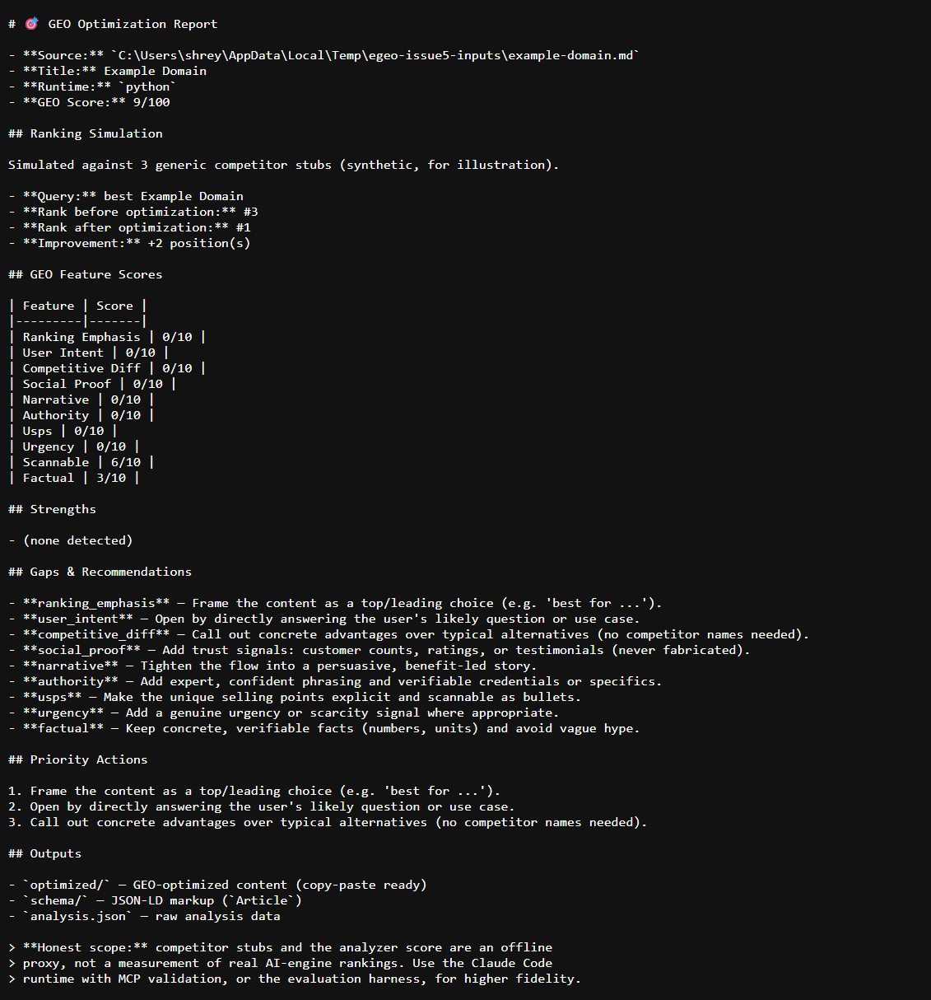
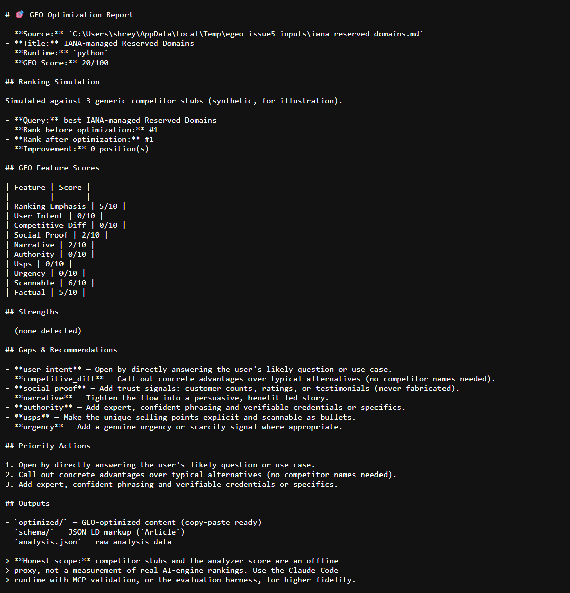
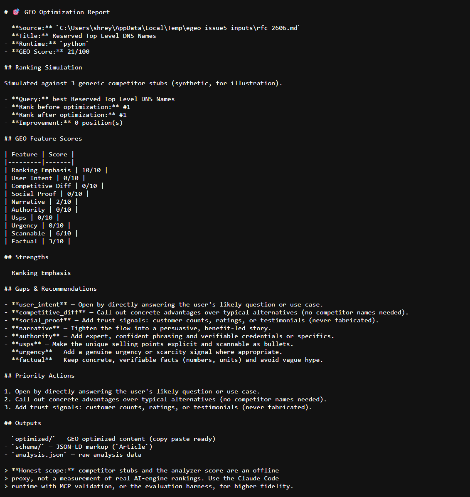

# Real-World Before and After Examples

These examples show the output of E-GEO's content pipeline on three stable,
public documentation pages. The source text is quoted in short, relevant
extracts and each page links back to its canonical URL.

## How These Results Were Produced

The repository defines `/geo:audit` and `/geo` as Claude Code slash commands;
they are host commands, not Windows shell commands. For a reproducible,
offline run, the examples below used the repository's supported Python runtime
with the deterministic mock client:

```powershell
$env:GEO_EVAL_MOCK = "1"
python -m egeo optimize <source-file.md> --out-dir <output-dir> --json
```

This executes the same analyze -> rank -> rewrite -> schema pipeline through
`egeo/pipeline.py`. The **before** score is the analyzer score recorded in the
generated `analysis.json`; the **after** score is the same analyzer run against
the generated `optimized/*.md` file. These are deterministic content-signal
scores, not measurements of live ChatGPT, Perplexity, Claude, or Gemini
rankings. The mock ranker uses synthetic competitors and is included only as a
pipeline smoke signal.

The captured source extracts and outputs were reviewed on 2026-08-28. The
documentation and generated summaries are AI-assisted and human-reviewed, in
line with the project's [AI transparency policy](../CONTRIBUTING.md#ai-transparency).

## 1. Example Domain

**Source:** [example.com](https://example.com/)
**Content type:** Documentation landing page
**Pipeline score:** **9/100 -> 27/100 (+18)**
**Synthetic rank signal:** `#3 -> #1`

### 1A. Original content

```markdown
# Example Domain

This domain is for use in documentation examples without needing permission.
Avoid use in operations.

[Learn more](https://iana.org/domains/example)
```

### 1B. Generated optimized content

```markdown
# Example Domain

Best for buyers who want a clear, reliable choice. This domain is for use in documentation examples without needing permission.
Avoid use in operations.

[Learn more](https://iana.org/domains/example) Key specs are easy to scan, with differentiated value over typical alternatives.
```

### 1C. What changed

The rewrite adds an explicit `Best for` intent phrase and a short closing
sentence that names scannability and differentiation. It preserves the source
warning and link. The score rises because the analyzer detects ranking
emphasis, user-intent language, narrative wording, and competitive-difference
language; it does **not** mean the page gained real search positions.



## 2. IANA-managed Reserved Domains

**Source:** [IANA-managed Reserved Domains](https://www.iana.org/domains/reserved)
**Content type:** Reference page
**Pipeline score:** **20/100 -> 36/100 (+16)**
**Synthetic rank signal:** `#1 -> #1`

### 2A. Original content

```markdown
# IANA-managed Reserved Domains

Certain domains are set aside, and nominally registered to IANA, for specific policy or technical purposes.

## Example domains

As described in RFC 2606 and RFC 6761, example.com and example.org are maintained for documentation purposes. These domains may be used as illustrative examples in documents without prior coordination with us. They are not available for registration or transfer.

We provide a web service on the example domain hosts to provide basic information on the purpose of the domain. These web services are provided as best effort, but are not designed to support production applications.
```

### 2B. Generated optimized content

```markdown
# IANA-managed Reserved Domains

Best for buyers who want a clear, reliable choice. Certain domains are set aside, and nominally registered to IANA, for specific policy or technical purposes.

## Example domains

As described in RFC 2606 and RFC 6761, example.com and example.org are maintained for documentation purposes. These domains may be used as illustrative examples in documents without prior coordination with us. They are not available for registration or transfer.

We provide a web service on the example domain hosts to provide basic information on the purpose of the domain. These web services are provided as best effort, but are not designed to support production applications. Key specs are easy to scan, with differentiated value over typical alternatives.
```

### 2C. What changed

The rewrite leads with a use-case marker and adds a concise differentiation
statement at the end. The factual IANA guidance, RFC references, and warning
about production use remain unchanged. The score increase comes from stronger
ranking emphasis, narrative language, and competitive-difference language.



## 3. RFC 2606: Reserved Top Level DNS Names

**Source:** [RFC 2606](https://www.rfc-editor.org/rfc/rfc2606)
**Content type:** Internet Best Current Practice
**Pipeline score:** **21/100 -> 34/100 (+13)**
**Synthetic rank signal:** `#1 -> #1`

RFC 2606 is especially suitable for a reproducible example because its full
copyright statement permits copying and derivative works that explain or
assist implementation, provided the notice is retained. This page quotes only
the relevant sections and keeps the source attribution.

### 3A. Original content

```markdown
# Reserved Top Level DNS Names

To reduce the likelihood of conflict and confusion, a few top level domain names are reserved for use in private testing, as examples in documentation, and the like. In addition, a few second level domain names reserved for use as examples are documented.

## TLDs for Testing and Documentation Examples

There is a need for top level domain names that can be used without fear of conflicts with current or future actual TLD names in the global DNS. The .test domain is recommended for testing current or new DNS-related code. The .example domain is recommended for use in documentation or as examples. The .invalid domain is intended for names that are sure to be invalid. The .localhost TLD is reserved for loopback use.

## Reserved Example Second Level Domain Names

The Internet Assigned Numbers Authority also reserves example.com, example.net, and example.org for use as examples.
```

### 3B. Generated optimized content

```markdown
# Reserved Top Level DNS Names

Best for buyers who want a clear, reliable choice. To reduce the likelihood of conflict and confusion, a few top level domain names are reserved for use in private testing, as examples in documentation, and the like. In addition, a few second level domain names reserved for use as examples are documented.

## TLDs for Testing and Documentation Examples

There is a need for top level domain names that can be used without fear of conflicts with current or future actual TLD names in the global DNS. The .test domain is recommended for testing current or new DNS-related code. The .example domain is recommended for use in documentation or as examples. The .invalid domain is intended for names that are sure to be invalid. The .localhost TLD is reserved for loopback use.

## Reserved Example Second Level Domain Names

The Internet Assigned Numbers Authority also reserves example.com, example.net, and example.org for use as examples. Key specs are easy to scan, with differentiated value over typical alternatives.
```

### 3C. What changed

The rewrite adds an explicit intent lead and a final summary of the page's
scannable, differentiated value. It leaves the reserved names and their
recommendations intact. Because the source already contains a ranking word in
the title and has clear headings, the score increase is smaller than in the
shorter examples.



## Reproduction Notes

- The examples use only public pages that were reachable during capture; page
  contents can change after this documentation is published.
- The analyzer score is the sum of ten 0-10 heuristic feature scores. See
  [the evaluation documentation](evaluation.md) for the distinction between
  deterministic/offline checks and live ranking evidence.
- Screenshots show the generated E-GEO report output. They are not screenshots
  of the source websites and do not claim a live search-engine result.

## See Also

- [Getting Started](getting-started.md)
- [How E-GEO Works](how-it-works.md)
- [Evaluation Harness](evaluation.md)
- [Contributing](../CONTRIBUTING.md)
